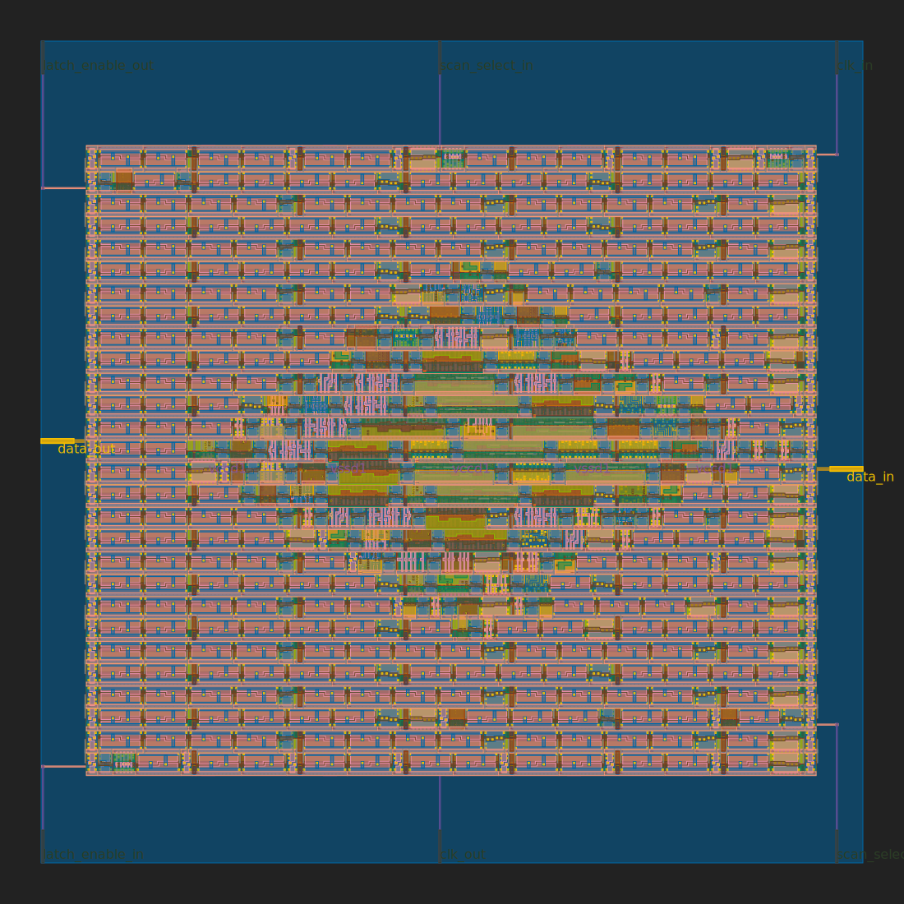

# Chisel to ASIC
Demo project that integrates the Chisel toolchain into the [TinyTapeout](https://tinytapeout.com) GDS generation workflow.

## Demo
* Chisel wrapper 
* 4 bits greatest common divisor
* Seven segment display driver

## Result

Original readme for the template repository [here](https://github.com/mattvenn/wokwi-verilog-gds-test/blob/main/README.md)

Based on [GuzTech/tinytapeout-4x4-multiplier](https://github.com/GuzTech/tinytapeout-4x4-multiplier)

