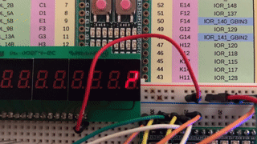

# 7 Segment Looping Figure Eight for TinyTapeout

A small looping figure 8/snake with fading tail for [TinyTapeout](http://tinytapeout.com/). Speed and direction are configurable using the input pins.

Hardware used for testing this demo project is the [iceFUN](https://www.robot-electronics.co.uk/icefun.html) FPGA board. I have been using `apio` to generate bitstream to load on hardware.

---

(Original readme from `omerk`'s repository [here](https://github.com/omerk/tinytapeout-verilog-test/blob/main/README.md))
